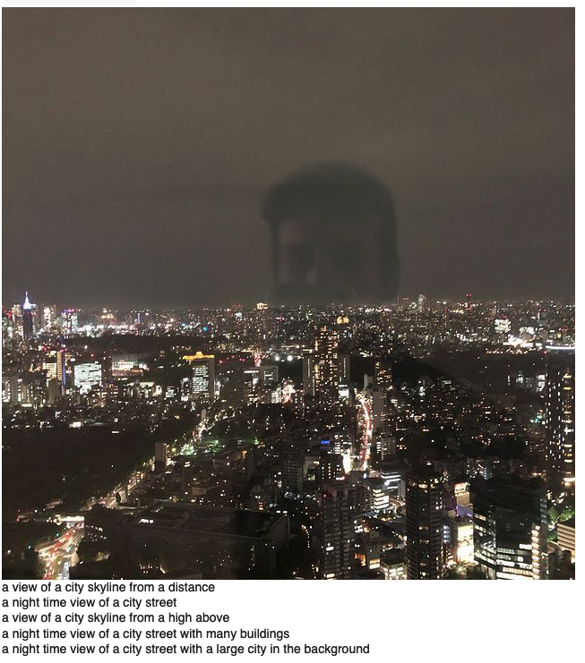

API for Image Captioning based on the papers [Self-critical Sequence Training for Image Captioning](https://arxiv.org/abs/1612.00563)

Credits to [ruotianluo](https://github.com/ruotianluo). For details on the implementation see his [colab](https://colab.research.google.com/github/ruotianluo/ImageCaptioning.pytorch/blob/colab/notebooks/captioning_demo.ipynb)



# Steps 

## Locally

```bash
$ pip install virtualenv
$ virtualenv imagecaption
$ source imagecaption/bin/activate
$ git clone https://github.com/JulianLopezB/ImageCaptionAPI.git
$ cd ImageCaptionAPI
$ pip install -r requirements.txt git+https://github.com/ruotianluo/ImageCaptioning.pytorch.git
```

### Download pretrain models 
```bash
$ mkdir model_data
$ gdown --id 1VmUzgu0qlmCMqM1ajoOZxOXP3hiC_qlL -O /model_data/model-best.pth
$ gdown --id 1zQe00W02veVYq-hdq5WsPOS3OPkNdq79 -O /model_data/infos_trans12-best.pkl
$ wget -O /model_data/detectron_model.pth wget https://dl.fbaipublicfiles.com/vilbert-multi-task/detectron_model.pth
$ wget -O /model_data/detectron_model.yaml wget https://dl.fbaipublicfiles.com/vilbert-multi-task/detectron_config.yaml
```

### Run server
```bash
$ python main.py
```
## Cloud
### Cloud Run (see [here](https://cloud.google.com/run/docs/quickstarts/build-and-deploy/deploy-python-service#deploy))
```bash
$ gcloud run deploy
```

# To Do:
- [x] object detection in images (jpg, jpeg, png)
- [x] object detection in videos (mp4, avi, mkv)
- [ ] add progress bar to webapp
- [ ] add Dockerfile
- [ ] create dropdown in webapp that allows choosing different models
- [ ] deploy to cloud
